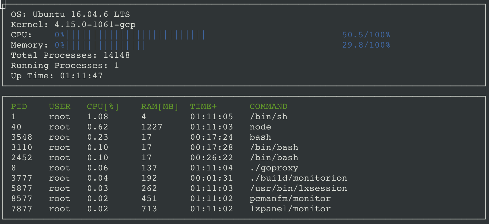

# System-Monitor

A System Monitor and Process Viewer for Linux built in C++. The Monitor shows system metrics like total memory usage, total CPU usage, etc. Also, it shows the resource usage by individual processes ordered by the amount of CPU usage.  
The ncurses library is used to display text-based graphical output in the terminal.  

The resource usage values are read from the `/proc` file and the monitor shows real-time values. The proc file values are parsed in `linux_parser.cpp`.
